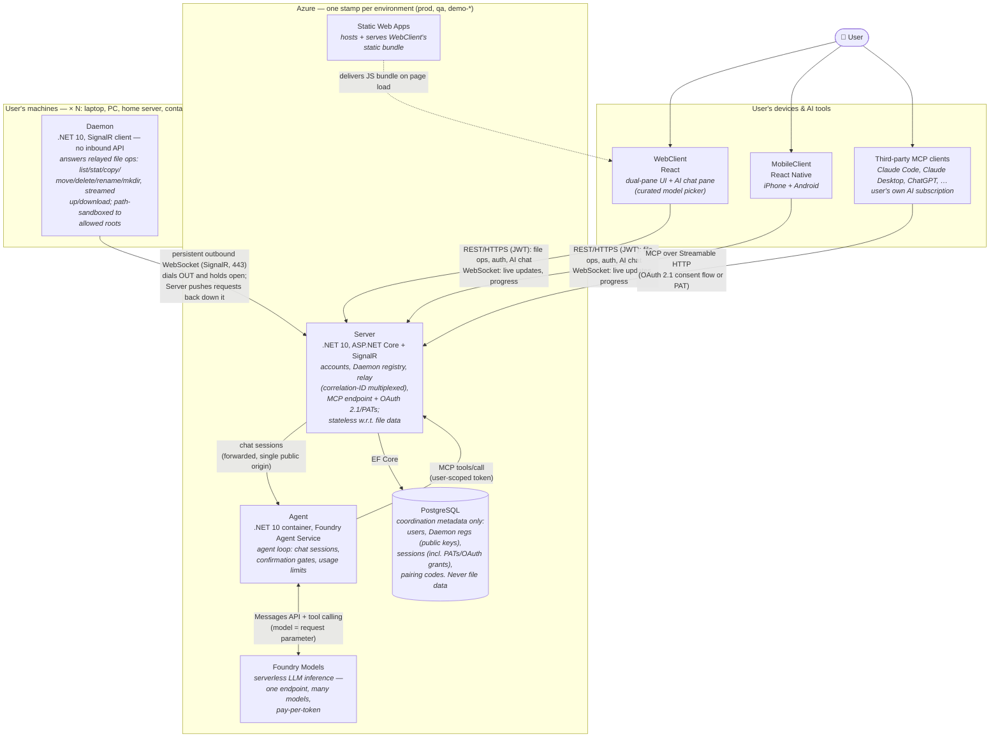
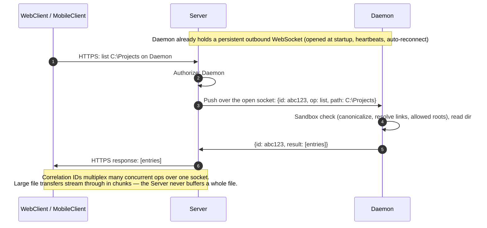
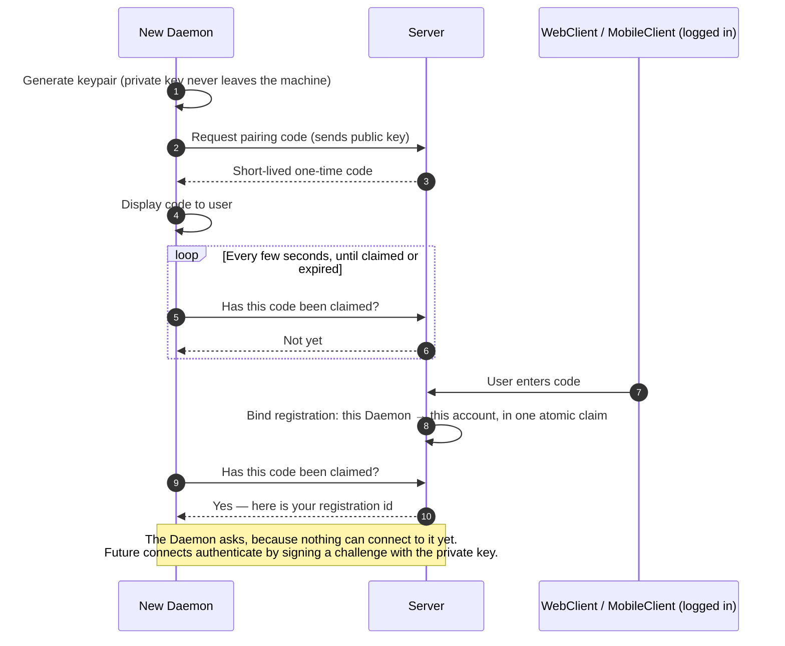
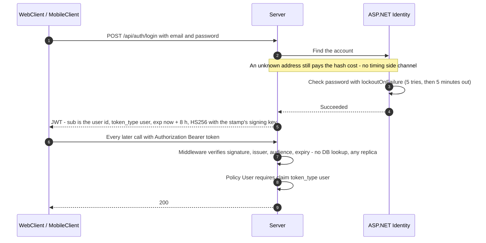
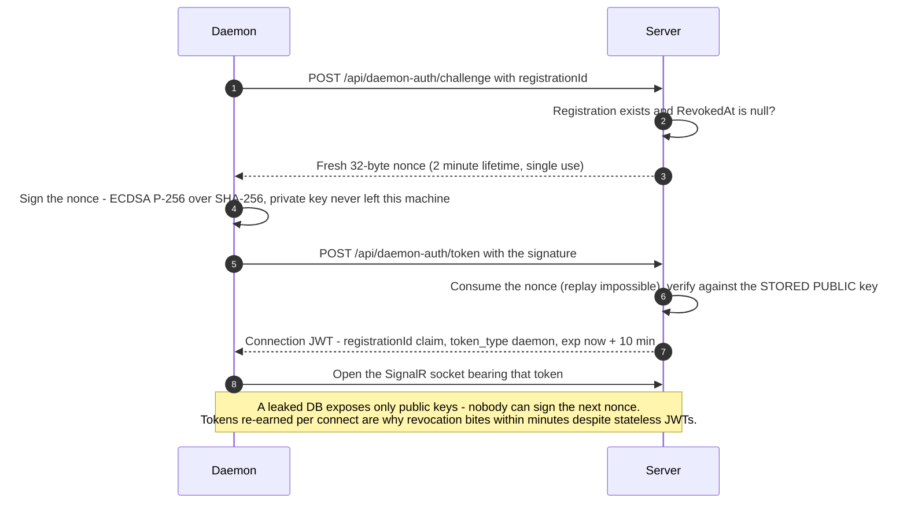
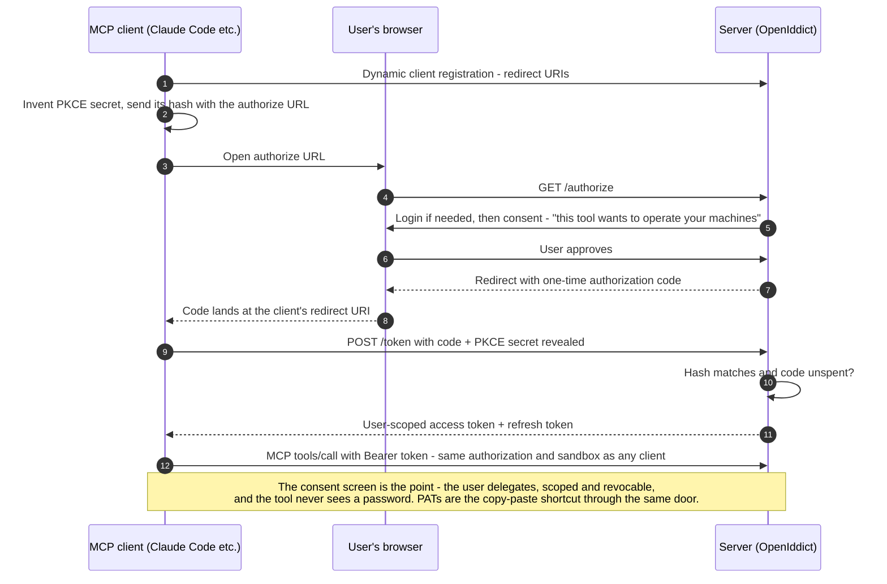
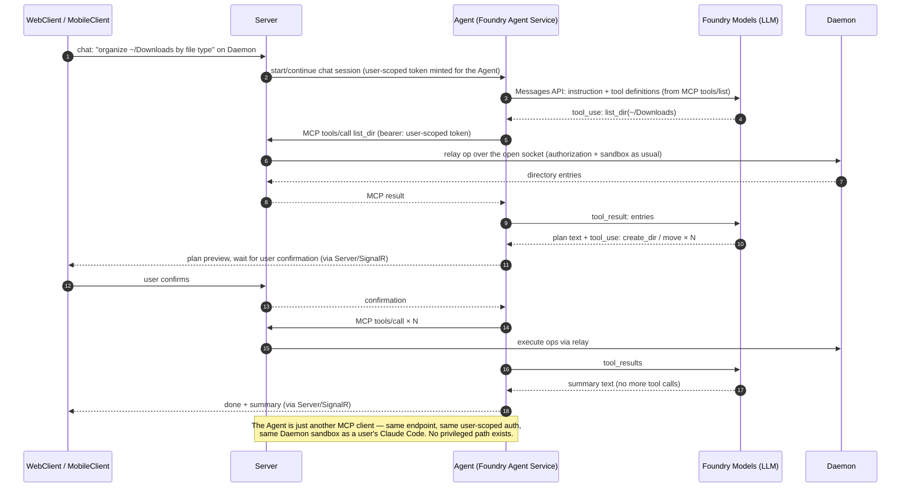
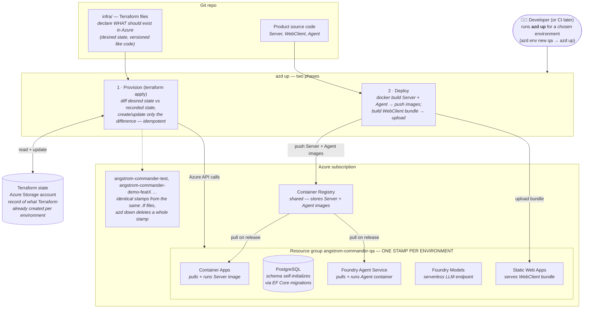

# Angstrom Commander — architecture

The what and why of the system: domain, components, tech stack, guardrails, security model, scaling, hosting, CI/CD, and diagrams. Working conventions live in [AGENTS.md](AGENTS.md); setup in [README.md](README.md).

## Domain

- Dual-pane file manager (Total Commander clone)
- Parsec-like model: a Daemon runs on each of the user's machines; one user account manages multiple machines from WebClient or MobileClient
- Cloud-based from day one — no VPN/LAN-only setup, no port forwarding expected from users
- AI-operable from day one: natural-language file tasks via the built-in assistant (Agent), or via any MCP client the user brings (Claude Code etc.)

## System components

The five products we build and ship (infrastructure like the DB is listed with its owning component):

1. **Daemon** — installed per machine; exposes that machine's file system over a secure channel. Runs on Windows, macOS, Linux, and inside Linux containers. User-installed, never cloud-hosted.
2. **Server** — user accounts, Daemon registry, connection brokering/relay, and the MCP endpoint (the file-op tool surface for AI clients). Backed by PostgreSQL (its only persistent store).
3. **WebClient** — dual-pane UI in the browser, incl. the AI chat pane.
4. **MobileClient** — iPhone + Android.
5. **Agent** — the built-in AI assistant's agent loop. Cloud-hosted, never on the user's machines.

Besides the products, the repo carries supporting codebases — authored and reviewed like code, but not shipped to anyone: `.github/workflows/` (GitHub Actions CI/CD), and `infra/` (Terraform + azd definitions of the Azure environments) once it is written.

## Tech stack

- **Daemon + Server + Agent**: .NET, latest LTS (currently .NET 10); xUnit for tests
  - Server additionally: **managed** PostgreSQL + EF Core (migrations; envs self-initialize schema when `Database:MigrateOnStartup` is set). Managed for anything holding real data — the schema is small but relational, transactional and security-sensitive (Identity, pairing claims, sessions), so a key-value or blob store would trade a few dollars for hand-rolled Identity stores and no multi-row atomicity. Throwaway stamps run Postgres in a container, since their data is disposable; ASP.NET Core Identity for user accounts (self-managed email+password; social logins deferred — offering any would trigger the mandatory Apple sign-in rule on iOS); OpenIddict for the OAuth 2.1 authorization server
- **WebClient**: latest React, TypeScript (strict); Vitest + React Testing Library for tests
- **MobileClient**: React Native (iOS + Android), TypeScript (strict); Jest + React Native Testing Library for tests (RN's supported runner — Vitest doesn't fit RN)

## Guardrails

Heavy emphasis on guardrails across the whole repo: every cheap, automatable quality gate is turned on from day one, and everything is enforced in CI on every PR — a guardrail that isn't enforced doesn't exist. Tests everywhere: every component has a test setup from its first commit, and new code is expected to come with tests.

**Daemon + Server + Agent (.NET)**
- `TreatWarningsAsErrors` + `AnalysisLevel: latest-all` (.NET analyzers) + `EnforceCodeStyleInBuild`, centralized in a root `Directory.Build.props`
- Nullable reference types enabled everywhere
- `.editorconfig` at repo root as the single source of style truth (full C# naming rules, EF Core `Migrations/` exempted as generated code); `dotnet format` verified in CI
- Code coverage collected on every test run

**WebClient + MobileClient**
- TypeScript strict mode (no `any` escapes; `@typescript-eslint` recommended-type-checked rules)
- ESLint + Prettier, enforced in CI (no warnings allowed, formatting is a build failure)

**Containers**
- Server and Daemon images run as a non-root user; the mount points a Daemon writes to are created with that ownership so its volumes stay writable

**infra/** (once it exists)
- `terraform fmt` + `terraform validate` on every PR

**Later (noted so they're not forgotten)**
- E2E: Playwright (WebClient), Maestro or Detox (MobileClient)

## Architecture

Diagrams: see the Diagrams section at the bottom.

**Daemon**
- Has no inbound API beyond a health probe, and never will: nothing may connect *to* a Daemon, which is what removes NAT, firewall and port-forwarding setup from the user's life. It is an ASP.NET Core host for its own lifecycle and health endpoint, and a SignalR **client** for everything else
- Dials out to the Server, holds that one connection open, and answers the file operations pushed down it: list, stat, copy/move/delete/rename, mkdir, streamed up/download
- Real-time travels the same way — directory change notifications and progress/cancel for long operations over the same connection, not a second channel
- Every client-supplied path is sandboxed to the allowed roots before anything touches the file system (see § Security model)

**Server**
- Relays traffic between clients (WebClient, MobileClient, MCP clients incl. the Agent) and Daemons over the Daemons' outbound connections:
  - Each Daemon holds one persistent outbound WebSocket (SignalR, port 443) open to the Server; the Server routes client requests down it and matches responses back. Reconnection never gives up — a Server deploy outlasts any bounded retry, and a Daemon that stopped trying would stay unreachable until someone restarted it — and backs off with jitter so a restart does not bring the whole fleet back at once
  - Correlation IDs multiplex many concurrent operations over the one socket
  - Works through NAT/firewalls because an established TCP connection is bidirectional regardless of who initiated it
  - Socket ownership is the Server's only per-replica state: with multiple replicas, a connection registry (Daemon → owning replica, in Redis) lets any replica find the one holding that Daemon's socket and forward the whole request there. Requests must follow the socket rather than messages crossing a bus, because a transfer's bounded channel lives in the owning replica's memory — Redis stays a small directory and never carries file bytes. A SignalR Redis backplane is not the answer here: it addresses fan-out (groups, users, all clients), still requires sticky sessions, and does nothing about in-process transfer channels. Azure SignalR Service is the alternative worth pricing when that time comes, since it would terminate the Daemon sockets itself. v1 runs one replica with an in-process map, but socket lookup sits behind an interface from the first commit so the registry is a swap, not surgery
  - File transfers stream through in chunks (never buffered whole); bulk transfers may get a second dedicated connection later
  - Every transfer is one bounded channel with a single writer and reader, which is what makes the dual pane's copy cheap: source Daemon → Server → target Daemon with no client round trip. A download is that channel read by the HTTP response, an upload is it written by the HTTP request. Backpressure is inherent — a slow reader slows the sender. (Note SignalR cannot push a stream to a client, so a receiving Daemon is told a transfer is waiting and pulls it.) Buffers make transfers a memory cost, so each user gets a ceiling on how many they may hold open — plus a daily byte quota and a bandwidth cap (relayed bytes are egress bytes, so these bound cost as well as memory) — and either end going away fails the transfer rather than leaving the other waiting
- MCP endpoint — the file-op tool surface exposed as a remote MCP server (Streamable HTTP, e.g. `api.<domain>.com/mcp`):
  - Same authorized, relayed, sandboxed ops as the Server's REST API — MCP is a protocol adapter over one tool surface, never a second implementation
  - Auth: OAuth 2.1 (authorization code + PKCE, dynamic client registration; OpenIddict) with Angstrom Commander login + consent pages; personal access tokens as the simpler first step. Both land in the sessions table (see the DB bullets below)
  - Consequence: any MCP client (Claude Code, Claude Desktop, ChatGPT, …) can operate the user's machines using the user's own AI subscription — third-party agents get no special access path
- DB stores coordination metadata only:
  - Daemon registrations: display name, Daemon public key, platform/OS/version, created / last_seen / revoked timestamps
  - Sessions — WebClient/MobileClient logins, PATs, and OAuth grants for MCP clients: hashed token, device/client info, scopes, timestamps + revocation (enables an "active sessions" page covering humans and AI alike)
  - Short-lived one-time enrollment (pairing) codes
- NOT in the DB: file data/metadata, the Daemon's FS config (allowed roots, and whether each is writable, are Daemon-side), and ephemeral state (Daemon online-status, active relay sessions live in memory/Redis)
- Reached via fixed DNS name (e.g. `api.<domain>.com`); environments = subdomains (`api.qa...`); feature-branch demos use Azure's auto-generated Container Apps URLs
- The WebClient is a different origin from the API (`app.` vs `api.`), so each environment names its WebClient origin in `Cors:AllowedOrigins` — empty by default, so an environment that has not been told refuses browsers rather than accepting any origin. Behind Container Apps' ingress the Server trusts `X-Forwarded-For`/`-Proto`, without which every caller would look like the proxy and share one rate-limit bucket

**WebClient & MobileClient**
- Configurable server URL (build config in WebClient, build flavor/hidden setting in MobileClient) so any build can target any environment

**Agent**
- Feature: user asks in natural language ("organize my Downloads by file type") in the WebClient/MobileClient chat pane and an LLM performs the file operations; a curated model picker chooses the LLM
- LLM: **Foundry Models** (Azure's model-as-a-service) — serverless pay-per-token inference, one endpoint fronting many models (Claude, GPT, …), so the model is a request parameter; resource lives in the environment's stamp
- Loop: the **Agent** (container on Foundry Agent Service) runs the tool-calling loop — model emits tool calls, the Agent executes them **as an MCP client of the Server's MCP endpoint** with a user-scoped token, feeds results back until the model finishes. The Agent is architecturally just another client: no privileged path, Daemon unchanged
- Safety: Daemon path sandboxing bounds the AI exactly like any client; destructive/mutating ops require user confirmation in the client before execution; no delete tool in v1; built-in usage burns our Azure tokens → per-user usage limits ship with the feature, not after
- Build order inside v1 (each step ships on its own, none is rework): core file manager → MCP endpoint with PATs (third-party agents work from here) → OAuth + consent → Agent + model picker
- Chat routing: WebClient/MobileClient never talk to the Agent directly — chat goes to the Server (existing JWT auth, single public origin), which forwards the session to the Agent and streams responses/confirmations back over the client's already-open SignalR connection. The Agent's endpoint is never publicly exposed
- Fallback: the Agent is a plain container speaking MCP — if Foundry Agent Service disappoints (GA'd mid-2026), it runs on Container Apps instead with an infra-only change

## Implementation status

Where the code actually is, as of July 2026 — a living list, so update it when a row moves.

**Working end to end** (locally, via `docker compose up`; verified with tests and by hand):

- Guardrails and CI from the first commit: warnings-as-errors, analyzers, formatting and type-checked lint gates for both .NET and the WebClient, tests with coverage on every push, and a compose smoke test that builds all three images and waits for the Daemon to reach the Server
- The relay: each Daemon holds one outbound SignalR connection and reconnects indefinitely; the Server routes requests down it. Socket lookup already sits behind `IDaemonConnectionRegistry`
- Accounts (ASP.NET Core Identity, JWT), TV-style enrollment (pairing code → user claims it → registration, claimed atomically), and Daemon connection tokens earned by signing a server challenge with the machine's private key
- Sign-in defences: account lockout, per-caller rate limits on every anonymous endpoint, no enumerable difference between a wrong password and an unknown account, and no signing key with a default
- File operations: list, streamed download, streamed upload, and machine-to-machine copy — all chunked through one bounded channel, never buffered whole, with per-chunk deadlines on both directions and per-user ceilings on concurrent transfers, relayed bytes per day (10 GiB default — every relayed byte is an egress byte, so this bounds what one account can cost), and bandwidth (100 Mbit/s default); both configurable per environment, crossing them answers 429. The WebClient shows the day's allowance as a progress bar in Settings (`GET /api/transfers/usage`), noting that only relayed transfers count
- Path sandbox with per-root read-only/writable flags, symlink and junction resolution, and the Daemon's own state kept unreachable
- Request bodies validated against the contract's own field limits, so bad input is a 400 rather than a database error
- The API contract is generated (C# → `openapi/AngstromCommander.Server.json` → the WebClient's `schema.d.ts`), with CI failing on drift
- Server and Daemon containers run as a non-root user
- WebClient: sign in / register, claim a pairing code, machine list with online status, dual-pane browser with download, upload and copy between panes (both asking before they replace a file). The Daemon reports what it shares (a `ListRoots` relay op), so picking a machine starts the pane in its first shared root, with a shared-folders dropdown (read-only roots marked) instead of a guessed path
- Unpair — the opposite of enrollment: a machine can be revoked from the WebClient (soft revoke, `RevokedAt`); it vanishes from the machine list, relay ops and the challenge refuse it, and the Daemon reacts — by push when connected, by the challenge refusal otherwise — by discarding its registration and returning to the pairing screen, TV-style
- Azure deployment: `infra/` is real — a shared Terraform module (imported the hand-made resource group and DNS zone, added the container registry) plus the per-environment stamp driven by `azd`. The `test` stamp is live: Server on Container Apps behind `api.test.angstrom.adamlengyel.com` (managed TLS), WebClient on Static Web Apps behind `app.test.…`, managed PostgreSQL whose schema self-initialized via migrations on first boot, CORS verified across the real origins, and `terraform fmt`/`validate` gating every PR
- The whole product loop verified over the public internet (July 2026): a real Windows Daemon enrolled against the test stamp, was claimed from the deployed WebClient, reconnects on its own through Server pauses, and serves relayed directory listings of `C:\` paths
- Merges to main deploy themselves: after the CI gates pass, a workflow provisions + deploys the test stamp under a federated (secretless) identity — what is live on test is main, as of its last green push

**Next, in order:** remaining file operations (mkdir, rename, delete, move) → MCP endpoint with PATs → OAuth + consent → Agent + model picker.

**Known gaps, all deliberate:**

- Registration is open to anyone who finds the URL (rate-limited, and the transfer quotas bound what an account can cost, but accounts are free to create). Before any public exposure: a registration switch or invite gate first (smallest, closes the whole class), then email verification and bot protection (e.g. Turnstile) as the open-registration trio. Obscurity is the only gate today

- Per-PR demo stamps are not wired yet (the pull-request federated credential already exists, so it is workflow work, not identity work). And the deploy pipeline knows only test: when prod exists, it must get an approval gate, never the same auto-deploy
- Binding a stamp's `api.` managed TLS certificate is a one-time manual step after first provision (`az containerapp hostname bind`, see infra/README.md): the azurerm provider cannot create Container Apps managed certificates, so Terraform creates the unbound domain and thereafter ignores the binding
- Sessions are stateless JWTs only: no sessions table, no refresh tokens, and no "active sessions" page (machine unpair exists; *session* revocation does not)
- The Server is single-replica by design for now (`maxReplicas: 1` in the stamp). The full inventory of per-replica state that moves to Redis together when that changes: the Daemon socket registry (already behind `IDaemonConnectionRegistry`), per-user transfer slots, and per-user daily usage counters — plus the piece that is real engineering rather than a swap: request forwarding between replicas ("requests follow the socket", § Architecture). Deliberately staying per-replica even then: the bandwidth token bucket (one transfer's bytes flow through one replica, and a shared bucket would put a Redis round trip in the hottest loop)
- Rate limiting buckets callers by remote address, and the Server trusts `X-Forwarded-For` from any proxy because Container Apps' ingress address is not known ahead of time. That is only sound while the ingress is the sole route in — put the Server anywhere reachable directly and a caller can forge their own bucket
- Downloads buffer into a browser Blob — fine for documents, wrong for very large files; the fix is a short-lived download ticket in the URL so the browser streams to disk
- No live-update channel for clients: panes refresh on navigation, and there is no transfer progress
- The WebClient bundle ships no Content-Security-Policy: it has to name the Server's origin, so it belongs with the Static Web Apps configuration rather than the compose-only nginx image
- Windows path handling is proven at the API level (a real Windows Daemon serves relayed `C:\` listings on the test stamp), but the WebClient's dual-pane browsing of Windows paths is still unit-tests-only
- The Daemon's private key sits unprotected on disk (no DPAPI/keychain/file-permission hardening) — the sandbox refuses to serve it however the roots are configured, but local file permissions must still be addressed before any real install story
- The path sandbox resolves links and then opens by path, so a link swapped in between the two would not be caught. Closing that needs opening by handle (`O_NOFOLLOW` and the Windows equivalent); it requires local write access to a shared folder to exploit, so it waits
- `MapOpenApi()` is not wired, so the contract exists only as a build artifact; there is no browsable API reference
- The Server integration suite boots a factory per test, which is most of its runtime, and could share one

## Security model

The model the system is built toward, which includes parts not written yet (MCP auth, refresh tokens, the sessions page). § Implementation status is the source of truth for what exists today.

- TLS everywhere; WebClient and MobileClient authenticate with JWT access tokens, and will carry hashed refresh tokens revocable per device once sessions are stored
- Sign-in is guessing-resistant: failed attempts lock the account (ASP.NET Core Identity's counters), wrong password and unknown account answer identically so the endpoint cannot be used to enumerate emails, and every anonymous endpoint — sign-in, registration, enrollment, the Daemon challenge/token exchange — is rate limited per caller
- No secret has a default: the JWT signing key ships nowhere in the repo (Development reads one from `appsettings.Development.json`, every other environment sets `Auth__JwtSigningKey`), and a Server configured without one refuses to issue or accept a token instead of falling back to something known
- The two live token types side by side (both HS256 with the stamp's key, verified by one middleware — after the signature check, the `token_type` claim is the only wall between their worlds, enforced by two authorization policies and pinned by a test):

  | | User token | Daemon token |
  | --- | --- | --- |
  | Earned by | password (+ lockout, rate limit) | signing a fresh nonce |
  | Lifetime | 8 hours | 10 minutes |
  | Claims | `sub` = user id, `token_type=user` | `registrationId`, `token_type=daemon` |
  | Carried in | `Authorization: Bearer` header | query string on the SignalR connect |
  | Opens | user endpoints (machines, files, unpair) | only the relay hub |
  | Revocation today | expiry only (refresh tokens planned) | ≤10 min via `RevokedAt` at the challenge |
- Daemon identity = keypair generated at enrollment; the Server stores only the public key (DB leak ≠ Daemon impersonation); revoking a registration kills that machine's access. The sandbox refuses to serve the Daemon's own state directory whatever the roots say, so sharing a folder that contains it cannot hand out the key that is the machine's identity
- Enrollment: Daemon shows a short-lived one-time pairing code, user enters it in a logged-in WebClient or MobileClient (TV-pairing style)
- Path sandboxing in the Daemon: canonicalize all client-supplied paths and resolve every symbolic link and junction along them, then enforce allowed roots — canonicalizing alone is lexical, so a link planted inside a shared folder would otherwise read and write outside it. Each root carries a writable flag and read-only is the default, so sharing a folder never implies permission to change it — writes resolve only against writable roots
- AI access: the Agent and third-party MCP clients act only through the Server's MCP endpoint with user-scoped tokens (OAuth 2.1 or PATs) — same authorization and Daemon sandbox as any client, no extra access path; mutating ops additionally require explicit user confirmation; every AI session is listed and revocable on the "active sessions" page

## Scaling

Sanity check against a large user base (hundreds of thousands of users → millions of enrolled Daemons, each holding an idle persistent WebSocket). The architecture's shape holds — the outbound-connection relay is the same pattern Parsec, TeamViewer, and ngrok run at larger scale — with two known pressure points, both planned for rather than redesigned around:

- **Connection routing** (the real bottleneck): no single Server instance holds a million sockets, so the Server becomes N replicas and requests must reach the replica owning the target Daemon's socket. Solved by the connection registry (see § Architecture — Server); it is designed into the relay from the first commit because retrofitting it later is surgery.
- **Relay bandwidth** (the real cost): every file transfer streams through Azure, so egress spend grows with users' copy habits — this is exactly why Parsec is P2P. The direct P2P upgrade (Parsec-style, brokered by the Server, relay as fallback) is not needed for v1 but becomes an economic requirement well before this scale.

What already scales without change: PostgreSQL stores coordination metadata only, so 500k users is a small database; the Server is stateless w.r.t. file data and streams in chunks, so replicas scale horizontally; Agent/LLM cost is pay-per-token with per-user usage limits — linear, no cliff. Smaller shifts at that scale, none structural: scale-to-zero stops mattering, Container Apps may yield to AKS if connection density demands it, and multi-region is more stamps from the same Terraform.

## Hosting & infrastructure

See the "Provisioning & deployment" diagram at the bottom for how the pieces fit together.

- Azure hosts everything hostable (Server, WebClient, Agent)
- Azure services: Azure Container Apps (Server — WebSockets; `minReplicas: 1`, because Daemons hold sockets open the Server cannot scale to zero — only Daemon-less environments can), Static Web Apps (WebClient hosting), Azure Container Registry, Microsoft Foundry (Foundry Models — serverless LLM inference, no idle cost; Foundry Agent Service — hosts the Agent container)
- Infrastructure as code: Terraform (via azd's Terraform provider) — `azd up` provisions + deploys; remote state in an Azure Storage account
- Environments are first-class: `azd env new <name>` + `azd up` spawns a full isolated env (test, qa, per-feature-branch demos, prod); one resource group per env; `azd down` tears it down. Prod is the same stamp with different variables (sizes/SKUs), never a hand-built special case
- Environment glossary — the canonical names, used everywhere an environment is meant:
  - **`local`** — the `docker compose up` stack on a dev machine. Not a stamp, not in Azure, data disposable. (Deliberately not called "dev": that would blur into .NET's `Development` mode and "dev machine", which are a framework setting and a piece of hardware)
  - **`test`** — the standing Azure stamp (live since July 2026): `api.test.` / `app.test.` under the zone
  - Planned, same pattern: **`qa`**, **`prod`** (prod alone owns the bare `api.` / `app.` names), and **`demo-<x>`** per-feature-branch stamps
  - For Azure stamps, one name appears in three places by construction: the azd environment, the resource-group suffix (`angstrom-commander-<name>`), and the DNS label. It also appears in a few hand-maintained tooling spots (REST Client environments, Daemon launch profiles) — infra/README.md § Adding an environment is the checklist
- `azd up` is idempotent: per resource Terraform no-ops, updates in place, or (only for immutable attribute changes) destroys-and-recreates — the plan marks replacements explicitly. Manual portal edits are drift and get reverted on the next apply; the `.tf` files always win
- Data safety: prod PostgreSQL gets a `prevent_destroy` lifecycle guard (blocks any destroying plan, incl. `azd down`); prod plans get human review before apply, demo envs may auto-apply
- Promotion is by commit, not by artifact: promoting a build to qa/prod means deploying the same commit with that environment's variables, and rebuilding along the way is accepted — lockfiles and pinned package versions keep rebuilds equivalent, and it is what `azd`'s per-environment build-and-deploy flow does naturally. (If that ever changes, the WebClient's build-time server URL becomes the first blocker: identical bundles would need the URL supplied at deploy time.)
- **Provisioned by hand (July 2026) — never recreate:**
  - Resource group `angstrom-commander-shared` (West Europe), the home for cross-stamp resources (DNS, the container registry, Terraform state) — now imported and managed by `infra/shared`
  - Storage account `angstromtfstate` in that group: holds every Terraform state file (blob versioning on), so it stays outside Terraform itself — `infra/README.md` records the bootstrap commands
  - Azure DNS zone `angstrom.adamlengyel.com` in that group (also imported into `infra/shared` now). The parent `adamlengyel.com` lives at an external registrar, where four NS records delegate this subdomain to Azure (`ns1-09.azure-dns.com`, `ns2-09.azure-dns.net`, `ns3-09.azure-dns.org`, `ns4-09.azure-dns.info`); delegation is live and verified. Terraform therefore creates per-environment records *inside* the zone without touching the registrar again
  - Naming: prod is `api.angstrom.adamlengyel.com`, other stamps are `api.<env>.angstrom.adamlengyel.com`; the WebClient gets `app.` equivalents. The apex `adamlengyel.com` is an unrelated personal site and must be left alone

## Operating costs

> **Estimated July 2026, West Europe. Keep this current** — re-check it whenever the hosting choices, SKUs, or replica counts change, and refresh the rates periodically even when nothing changes: Azure prices drift, and a stale table here is more misleading than no table. Same living-document rule as the rest of this file. Only permanent free allowances are counted (never new-customer trials, which expire and would make the numbers lie later).

Rates come from Azure's retail prices API for West Europe (`prices.azure.com/api/retail/prices`), which is the way to re-check them: Container Apps Consumption at **$0.000034 per vCPU-second active** ($0.000004 idle) and **$0.000004 per GiB-second** (memory has no idle discount), requests at $0.56 per million after the first two million, PostgreSQL B1ms at $0.0199/hour plus $0.1369/GiB-month of storage. Assumes active billing, one enrolled Daemon, and light personal traffic. Each environment is priced on its own, at full rates — see the note after the table for the one discount left out.

| Component | prod (always on) | test (12 h/day ≈ 365 h) | demo123 (3-day stamp, ~2 h used) |
| --- | --- | --- | --- |
| **Server** — Container Apps, 0.25 vCPU / 0.5 GiB | ~$28 (730 h) | ~$14 (365 h) | ~$0.10 (scales to zero) |
| **PostgreSQL** | Flexible Server B1ms + 32 GiB: ~$19 | its own Flexible Server B1ms, always on: ~$19 (shared test data must survive restarts, so this cannot be containerized — see the note below) | containerized in the stamp, disposable: ~$3 |
| **HTTP requests** — first 2M/month free, then $0.56/M | $0 | $0 | $0 |
| **WebClient** — Static Web Apps, free tier | $0 | $0 | $0 |
| **Container Registry** — ACR Basic | ~$5 (shared by all stamps) | shared | shared |
| **DNS zone** | ~$0.50 (shared) | shared | shared |
| **Log Analytics** — 5 GB/month included | $0–3 | $0 | $0 |
| **Egress** — first 100 GB/month free, then ~$0.087/GB | $0 at light use | $0 | $0 |
| **Agent / LLM tokens** — pay-per-token, per-user caps | $0 until the Agent ships | — | — |
| **Redis** — only once the Server runs >1 replica | $0 today, ~$16 when needed | — | — |
| **Total** | **~$53/month** | **~$33/month** | **~$3 for its whole life** |

Which PostgreSQL an environment gets is a stamp variable, not a different stamp: **managed wherever data must survive** (prod, and any shared environment people rely on), **containerized only where the data is disposable** (per-branch demo stamps, local compose). There is no third option in this hosting model — a container's filesystem is ephemeral, and Container Apps' only volume type is Azure Files over SMB, which PostgreSQL does not support as a data directory (it requires `0700` on `PGDATA`, which SMB cannot express, and lacks dependable `fsync`). "Containerized" therefore always means "disposable".

Two things drive the bill, and neither is the resource list:

- **The Server cannot sleep.** Daemons hold sockets open, so `minReplicas: 1` is required and prod pays 24/7. That is the direct price of the "no NAT, no port forwarding" promise. The idle rate is 8.5× cheaper on vCPU (memory costs the same either way) and applies to a replica that is *not processing requests*, but a live WebSocket plausibly counts as one — so budget the active rate and treat idle as upside (~$8/month instead of ~$28 if it ever applied).
- **Egress scales with what users move.** Downloads and the outbound leg of a machine-to-machine copy leave Azure; inbound is free. 100 GB/month is free, so personal use is $0 — but 1 TB/month of relayed transfers is ~$78/month. That is the § Scaling P2P argument stated in currency.

Overbilling detection is a subscription-level **budget alert** (`monthly-spend-guard`: $100/month, emails at 40/60/80/100% of actual spend). It guards the owner's whole subscription, not just this project, so it is deliberately *not* managed by this repo's Terraform — noted here because it is part of the cost-safety story: detection rather than a cap (Azure pay-as-you-go has no hard spending limit), with the pause procedure in infra/README.md as the response.

The test column's 12 h/day figure is an *assumption about usage, not something the stamp does by itself*: the standing test environment runs `minReplicas: 1` around the clock, so left alone it bills like the prod column (~$28 Server + ~$19 PostgreSQL ≈ $47/month) — the 12 h figure is what stopping it outside working hours would earn. The Terraform state storage account adds pennies (LRS, kilobytes of state).

Levers: a standing environment nobody is using right now can be *paused* — Server revision deactivated, PostgreSQL stopped (infra/README.md § Pausing an environment) — dropping it to ~$4–5/month of storage, with the caveat that Azure restarts a stopped PostgreSQL by itself after 7 days. PostgreSQL on a standing free serverless tier (e.g. Neon, which scales to zero and is ample for this schema) takes prod to ~$34/month. Demo stamps cost almost nothing while no Daemon is paired to them — pair one and its reconnect loop keeps the environment awake, which removes the saving.

One discount is deliberately left out of the figures above: Container Apps includes 180,000 vCPU-seconds and 360,000 GiB-seconds per subscription per month, worth roughly $7.50 at these rates. It is consumed once across all environments rather than per environment, so the real invoice should come out about $7.50 below the sum of any columns here.

**Scaling up is a cliff, not a ramp.** Everything above uses the serverless Consumption profile, where a replica costs what it allocates. The alternative — a Dedicated workload profile, which § Scaling names as the step before AKS — rents whole nodes continuously and adds a **$0.10/hour Dedicated plan management fee**: the smallest profile (D4, 4 vCPU / 16 GiB) is ~$236 compute + ~$78 memory + $73 management ≈ **$387/month**, roughly 14× the Server's current footprint. Growing by adding 0.25 vCPU Consumption replicas (~$28 each) stays cheaper for a long time. Note also that the management fee attaches to an environment using private endpoints or planned maintenance *even on Consumption*, so enabling either is a ~$73/month decision rather than a checkbox.

## Source control & CI/CD

- GitHub hosts the repo: <https://github.com/Anarkin/angstrom-commander> (private, personal account — free tier is ample for solo, incl. 2,000 Actions minutes/month)
- CI/CD: GitHub Actions. Deploys are wired (July 2026): merges to main run the CI gates, and on success the `azure-dev.yml` workflow deploys to the test stamp — `azd provision` (idempotent, so infra changes ride along) + `azd deploy`, authenticating via the `msi-angstrom-commander` federated identity that `azd pipeline config` created (OIDC — no cloud secrets stored in GitHub)
- Every PR runs the full guardrail suite: build (warnings = errors), tests, `dotnet format`, ESLint/Prettier, contract-drift checks, and a compose smoke test that builds all three images and waits for the Daemon to reach the Server (`terraform fmt`/`validate` join it with `infra/`)
- Later: PR-open spawns a demo env (`azd up` for `demo-prN`), PR-close tears it down

## Dev environment

- Everything runs in Docker containers; dev machines likely run Rancher Desktop (Windows)
- One command is the whole setup: `docker compose up` brings up the Server (+ its PostgreSQL), the WebClient, and a Daemon that pairs itself. The Agent joins them when it exists
- The Agent runs locally as a plain container (Foundry Agent Service is prod hosting, not a dev dependency); it points at a real Foundry Models endpoint — there is no local LLM, dev inference is pay-per-token against a dev Foundry resource

## Open questions

- When the direct P2P connection upgrade ships — not whether (see § Scaling: relay egress cost makes it an economic requirement at scale, though not for v1)
- Which LLMs earn a slot in the curated model picker at launch (tool-calling quality varies widely across the Foundry catalog); per-model SDK: Claude via the official `Anthropic.Foundry` .NET SDK, others via the OpenAI-compatible surface

## Diagrams

### Containers

Key point: **every connection is initiated toward the cloud** — nothing ever connects *to* a Daemon or client, which is why no NAT/firewall/port-forwarding setup is needed anywhere. The same funnel applies to AI: the Agent and third-party MCP clients reach files only through the Server's MCP endpoint — one tool surface, one authorization path, no exceptions.

### Relay flow — "list a directory"

### Enrollment flow — pairing a new machine

### User sign-in — password to bearer token

### Daemon connection auth — proving the keypair, every connect

### MCP authorization — OAuth 2.1 consent flow (planned, per § Architecture)

### AI assistant flow — "organize this folder"

Third-party flow (Claude Code etc.) is the same picture minus the Agent and Foundry Models: the MCP client calls the Server's MCP endpoint directly with its OAuth/PAT token, and the user's own LLM fills the Foundry Models role on their side.

### Provisioning & deployment — how `infra/`, Terraform, and Azure fit together

How to read it: `infra/` *describes* the environment; Terraform makes Azure *match* the description (using its state file to know what already exists — so re-runs are no-ops and edits apply only deltas); every environment is the same description stamped into its own resource group; `azd up` = provision + deploy (make infrastructure exist, then put code into it), `azd down` = delete the stamp.
