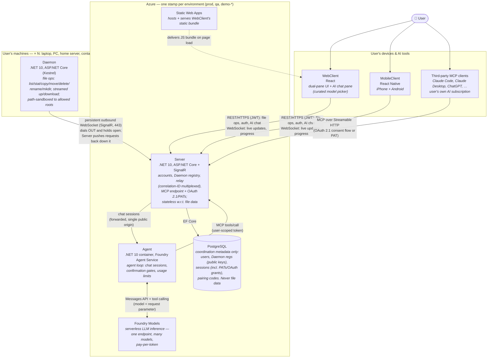
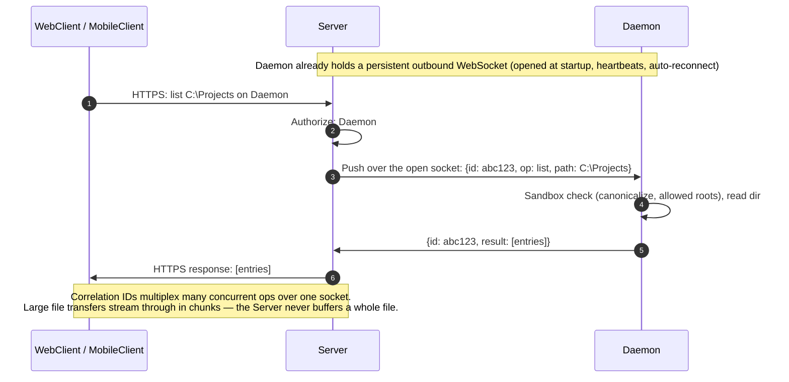
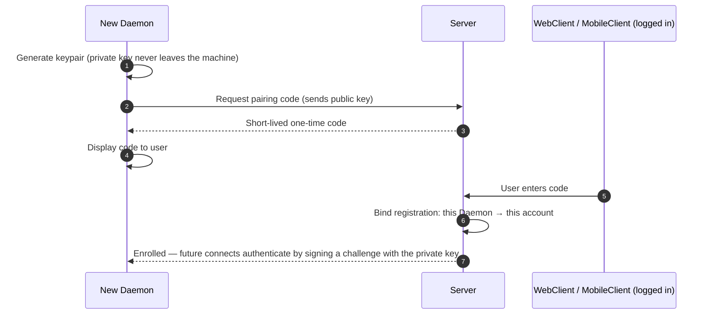
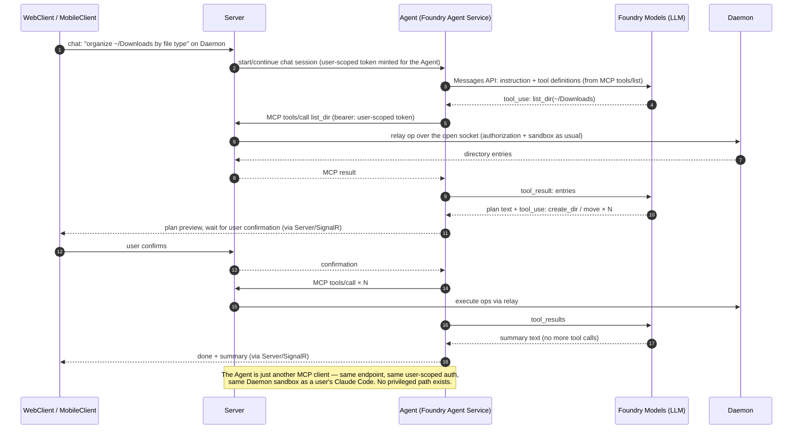

# Angstrom Commander — architecture

The what and why of the system: domain, components, tech stack, guardrails, security model, scaling, hosting, CI/CD, and diagrams. Working conventions live in [AGENTS.md](AGENTS.md); setup in [README.md](README.md).

## Domain

- Dual-pane file manager (Total Commander clone)
- Parsec-like model: a Daemon runs on each of the user's machines; one user account manages multiple machines from WebClient or MobileClient
- Cloud-based from day one — no VPN/LAN-only setup, no port forwarding expected from users
- AI-operable from day one: natural-language file tasks via the built-in assistant (Agent), or via any MCP client the user brings (Claude Code etc.)

## System components

The five products we build and ship (infrastructure like the DB is listed with its owning component):

1. **Daemon** — installed per machine; exposes that machine's file system over a secure channel. Runs on Windows, macOS, Linux, and inside Linux containers. User-installed, never cloud-hosted.
2. **Server** — user accounts, Daemon registry, connection brokering/relay, and the MCP endpoint (the file-op tool surface for AI clients). Backed by PostgreSQL (its only persistent store).
3. **WebClient** — dual-pane UI in the browser, incl. the AI chat pane.
4. **MobileClient** — iPhone + Android.
5. **Agent** — the built-in AI assistant's agent loop. Cloud-hosted, never on the user's machines.

Besides the products, the repo carries supporting codebases — authored and reviewed like code, but not shipped to anyone: `infra/` (Terraform + azd definitions of the Azure environments) and `.github/workflows/` (GitHub Actions CI/CD).

## Tech stack

- **Daemon + Server + Agent**: .NET, latest LTS (currently .NET 10); xUnit for tests
  - Server additionally: PostgreSQL + EF Core (migrations; fresh envs self-initialize schema); ASP.NET Core Identity for user accounts (self-managed email+password; social logins deferred — offering any would trigger the mandatory Apple sign-in rule on iOS); OpenIddict for the OAuth 2.1 authorization server
- **WebClient**: latest React, TypeScript (strict); Vitest + React Testing Library for tests
- **MobileClient**: React Native (iOS + Android), TypeScript (strict); Jest + React Native Testing Library for tests (RN's supported runner — Vitest doesn't fit RN)

## Guardrails

Heavy emphasis on guardrails across the whole repo: every cheap, automatable quality gate is turned on from day one, and everything is enforced in CI on every PR — a guardrail that isn't enforced doesn't exist. Tests everywhere: every component has a test setup from its first commit, and new code is expected to come with tests.

**Daemon + Server + Agent (.NET)**
- `TreatWarningsAsErrors` + `AnalysisLevel: latest-all` (.NET analyzers) + `EnforceCodeStyleInBuild`, centralized in a root `Directory.Build.props`
- Nullable reference types enabled everywhere
- `.editorconfig` at repo root as the single source of style truth (full C# naming rules, EF Core `Migrations/` exempted as generated code); `dotnet format` verified in CI
- Code coverage collected on every test run

**WebClient + MobileClient**
- TypeScript strict mode (no `any` escapes) with type-aware lint rules (the typescript-eslint ruleset, run by oxlint/tsgolint)
- oxlint (type-aware) + oxfmt (Prettier-conformant Rust formatter), enforced in CI (no warnings allowed, formatting is a build failure)

**infra/**
- `terraform fmt` + `terraform validate` on every PR

**Later (noted so they're not forgotten)**
- E2E: Playwright (WebClient), Maestro or Detox (MobileClient)

## Architecture

Diagrams: see the Diagrams section at the bottom.

**Daemon**
- ASP.NET Core (Kestrel) — REST API over HTTPS for file ops (list, stat, copy/move/delete/rename, mkdir, streamed up/download)
- SignalR (WebSockets) for real-time: directory change notifications, progress + cancel for long operations
- Dials out to the Server via persistent outbound connection

**Server**
- Relays traffic between clients (WebClient, MobileClient, MCP clients incl. the Agent) and Daemons over the Daemons' outbound connections:
  - Each Daemon holds one persistent outbound WebSocket (SignalR, port 443) open to the Server; the Server routes client requests down it and matches responses back
  - Correlation IDs multiplex many concurrent operations over the one socket
  - Works through NAT/firewalls because an established TCP connection is bidirectional regardless of who initiated it
  - Socket ownership is the Server's only per-replica state: with multiple replicas, a connection registry (Daemon → owning replica, in Redis) routes each request directly to the replica holding that Daemon's socket — NOT SignalR's Redis backplane, which broadcasts every message to every replica and collapses under this pattern. v1 runs one replica with an in-process map, but socket lookup sits behind an interface from the first commit so the registry is a swap, not surgery
  - File transfers stream through in chunks (never buffered whole); bulk transfers may get a second dedicated connection later
- MCP endpoint — the file-op tool surface exposed as a remote MCP server (Streamable HTTP, e.g. `api.<domain>.com/mcp`):
  - Same authorized, relayed, sandboxed ops as the REST API — MCP is a protocol adapter over one tool surface, never a second implementation
  - Auth: OAuth 2.1 (authorization code + PKCE, dynamic client registration; OpenIddict) with Angstrom Commander login + consent pages; personal access tokens as the simpler first step. Both land in the sessions table (see the DB bullets below)
  - Consequence: any MCP client (Claude Code, Claude Desktop, ChatGPT, …) can operate the user's machines using the user's own AI subscription — third-party agents get no special access path
- DB stores coordination metadata only:
  - Daemon registrations: display name, Daemon public key, platform/OS/version, created / last_seen / revoked timestamps
  - Sessions — WebClient/MobileClient logins, PATs, and OAuth grants for MCP clients: hashed token, device/client info, scopes, timestamps + revocation (enables an "active sessions" page covering humans and AI alike)
  - Short-lived one-time enrollment (pairing) codes
- NOT in the DB: file data/metadata, the Daemon's FS config (allowed roots are Daemon-side), and ephemeral state (Daemon online-status, active relay sessions live in memory/Redis)
- Reached via fixed DNS name (e.g. `api.<domain>.com`); environments = subdomains (`api.qa...`); feature-branch demos use Azure's auto-generated Container Apps URLs

**WebClient & MobileClient**
- Configurable server URL (build config in WebClient, build flavor/hidden setting in MobileClient) so any build can target any environment

**Agent**
- Feature: user asks in natural language ("organize my Downloads by file type") in the WebClient/MobileClient chat pane and an LLM performs the file operations; a curated model picker chooses the LLM
- LLM: **Foundry Models** (Azure's model-as-a-service) — serverless pay-per-token inference, one endpoint fronting many models (Claude, GPT, …), so the model is a request parameter; resource lives in the environment's stamp
- Loop: the **Agent** (container on Foundry Agent Service) runs the tool-calling loop — model emits tool calls, the Agent executes them **as an MCP client of the Server's MCP endpoint** with a user-scoped token, feeds results back until the model finishes. The Agent is architecturally just another client: no privileged path, Daemon unchanged
- Safety: Daemon path sandboxing bounds the AI exactly like any client; destructive/mutating ops require user confirmation in the client before execution; no delete tool in v1; built-in usage burns our Azure tokens → per-user usage limits ship with the feature, not after
- Build order inside v1 (each step ships on its own, none is rework): core file manager → MCP endpoint with PATs (third-party agents work from here) → OAuth + consent → Agent + model picker
- Chat routing: WebClient/MobileClient never talk to the Agent directly — chat goes to the Server (existing JWT auth, single public origin), which forwards the session to the Agent and streams responses/confirmations back over the client's already-open SignalR connection. The Agent's endpoint is never publicly exposed
- Fallback: the Agent is a plain container speaking MCP — if Foundry Agent Service disappoints (GA'd mid-2026), it runs on Container Apps instead with an infra-only change

## Security model

- TLS everywhere; WebClient and MobileClient authenticate with JWT access tokens + hashed refresh tokens (revocable per device)
- Daemon identity = keypair generated at enrollment; the Server stores only the public key (DB leak ≠ Daemon impersonation); revoking a registration kills that machine's access
- Enrollment: Daemon shows a short-lived one-time pairing code, user enters it in a logged-in WebClient or MobileClient (TV-pairing style)
- Path sandboxing in the Daemon: canonicalize all client-supplied paths, enforce allowed roots (no traversal)
- AI access: the Agent and third-party MCP clients act only through the Server's MCP endpoint with user-scoped tokens (OAuth 2.1 or PATs) — same authorization and Daemon sandbox as any client, no extra access path; mutating ops additionally require explicit user confirmation; every AI session is listed and revocable on the "active sessions" page

## Scaling

Sanity check against a large user base (hundreds of thousands of users → millions of enrolled Daemons, each holding an idle persistent WebSocket). The architecture's shape holds — the outbound-connection relay is the same pattern Parsec, TeamViewer, and ngrok run at larger scale — with two known pressure points, both planned for rather than redesigned around:

- **Connection routing** (the real bottleneck): no single Server instance holds a million sockets, so the Server becomes N replicas and requests must reach the replica owning the target Daemon's socket. Solved by the connection registry (see § Architecture — Server); it is designed into the relay from the first commit because retrofitting it later is surgery.
- **Relay bandwidth** (the real cost): every file transfer streams through Azure, so egress spend grows with users' copy habits — this is exactly why Parsec is P2P. The direct P2P upgrade (Parsec-style, brokered by the Server, relay as fallback) is not needed for v1 but becomes an economic requirement well before this scale.

What already scales without change: PostgreSQL stores coordination metadata only, so 500k users is a small database; the Server is stateless w.r.t. file data and streams in chunks, so replicas scale horizontally; Agent/LLM cost is pay-per-token with per-user usage limits — linear, no cliff. Smaller shifts at that scale, none structural: scale-to-zero stops mattering, Container Apps may yield to AKS if connection density demands it, and multi-region is more stamps from the same Terraform.

## Hosting & infrastructure

See the "Provisioning & deployment" diagram at the bottom for how the pieces fit together.

- Azure hosts everything hostable (Server, WebClient, Agent)
- Azure services: Azure Container Apps (Server — WebSockets, scale to zero), Static Web Apps (WebClient hosting), Azure Container Registry, Microsoft Foundry (Foundry Models — serverless LLM inference, no idle cost; Foundry Agent Service — hosts the Agent container)
- Infrastructure as code: Terraform (via azd's Terraform provider) — `azd up` provisions + deploys; remote state in an Azure Storage account
- Environments are first-class: `azd env new <name>` + `azd up` spawns a full isolated env (test, qa, per-feature-branch demos, prod); one resource group per env; `azd down` tears it down. Prod is the same stamp with different variables (sizes/SKUs), never a hand-built special case
- `azd up` is idempotent: per resource Terraform no-ops, updates in place, or (only for immutable attribute changes) destroys-and-recreates — the plan marks replacements explicitly. Manual portal edits are drift and get reverted on the next apply; the `.tf` files always win
- Data safety: prod PostgreSQL gets a `prevent_destroy` lifecycle guard (blocks any destroying plan, incl. `azd down`); prod plans get human review before apply, demo envs may auto-apply

## Source control & CI/CD

- GitHub hosts the repo: <https://github.com/Anarkin/angstrom-commander> (private, personal account — free tier is ample for solo, incl. 2,000 Actions minutes/month)
- CI/CD: GitHub Actions; `azd pipeline config` bootstraps the workflow + OIDC federated identity to Azure (no cloud secrets stored in GitHub)
- Every PR runs the full guardrail suite: build (warnings = errors), tests, `dotnet format`, oxlint/oxfmt, `terraform fmt`/`validate`
- Later: PR-open spawns a demo env (`azd up` for `demo-prN`), PR-close tears it down

## Dev environment

- Everything runs in Docker containers; dev machines likely run Rancher Desktop (Windows)
- Setup guide should center on a single simple docker command (e.g. `docker compose up`) that brings up Server (+ its PostgreSQL), WebClient, and the Agent out of the box
- The Agent runs locally as a plain container (Foundry Agent Service is prod hosting, not a dev dependency); it points at a real Foundry Models endpoint — there is no local LLM, dev inference is pay-per-token against a dev Foundry resource

## Open questions

- Azure hosting flavor for PostgreSQL: Flexible Server (stoppable, not auto-pause) vs Postgres-in-a-container for throwaway demo envs
- When the direct P2P connection upgrade ships — not whether (see § Scaling: relay egress cost makes it an economic requirement at scale, though not for v1)
- Which LLMs earn a slot in the curated model picker at launch (tool-calling quality varies widely across the Foundry catalog); per-model SDK: Claude via the official `Anthropic.Foundry` .NET SDK, others via the OpenAI-compatible surface
## Diagrams

### Containers

Key point: **every connection is initiated toward the cloud** — nothing ever connects *to* a Daemon or client, which is why no NAT/firewall/port-forwarding setup is needed anywhere. The same funnel applies to AI: the Agent and third-party MCP clients reach files only through the Server's MCP endpoint — one tool surface, one authorization path, no exceptions.

### Relay flow — "list a directory"

### Enrollment flow — pairing a new machine

### AI assistant flow — "organize this folder"

Third-party flow (Claude Code etc.) is the same picture minus the Agent and Foundry Models: the MCP client calls the Server's MCP endpoint directly with its OAuth/PAT token, and the user's own LLM fills the Foundry Models role on their side.

### Provisioning & deployment — how `infra/`, Terraform, and Azure fit together

How to read it: `infra/` *describes* the environment; Terraform makes Azure *match* the description (using its state file to know what already exists — so re-runs are no-ops and edits apply only deltas); every environment is the same description stamped into its own resource group; `azd up` = provision + deploy (make infrastructure exist, then put code into it), `azd down` = delete the stamp.
