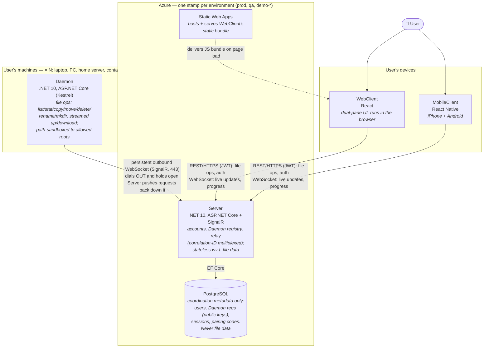
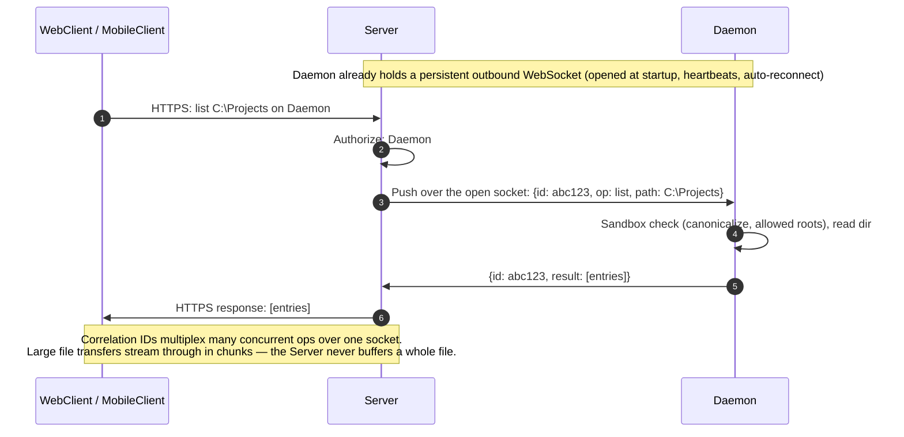
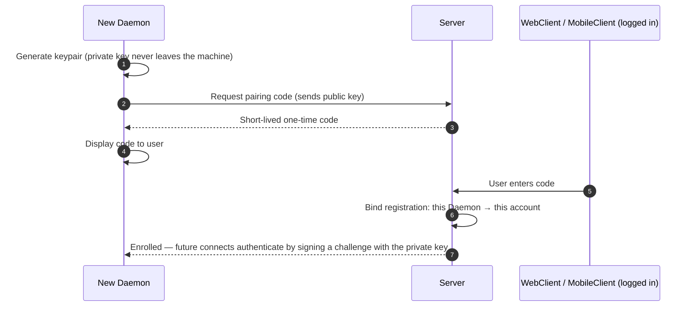
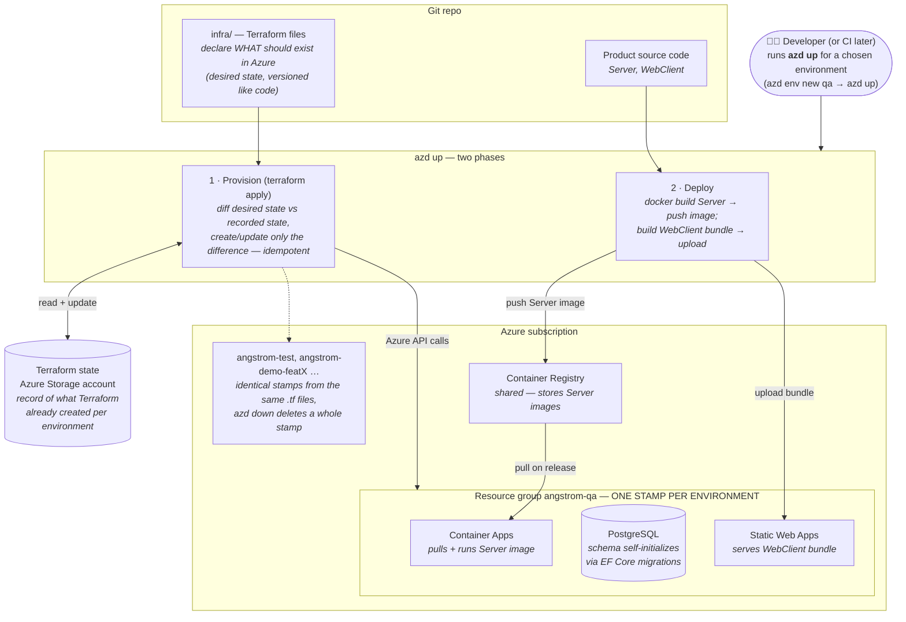

# Angstrom

Product name: **Angstrom** (unit-of-distance naming à la Parsec — all your machines, an ångström apart). The repo was started under the working title `nucleoreaction` and is being renamed to match the product.

## Conventions

- Component names: **Daemon**, **Server**, **WebClient**, **MobileClient** — always these exact capitalized names, no synonyms ("agent", "backend", "cloud service", "clients" are all retired). Lowercase "client"/"daemons" may appear only as generic protocol-role words, never as product references.
- No invented codenames beyond **Angstrom** itself — components get plain descriptive names.
- This file and its diagrams are living documents — update them in the same change that alters a decision, architecture, or the security model.
- Mermaid diagrams: use `flowchart` and `sequenceDiagram` syntaxes only; the experimental `C4Context`/`C4Container` syntax is banned (unreadable label layout). No semicolons inside sequence-diagram message text (mermaid parses them as statement separators and the diagram breaks).

## Domain

- Dual-pane file manager (Total Commander clone)
- Parsec-like model: a Daemon runs on each of the user's machines; one user account manages multiple machines from WebClient or MobileClient
- Cloud-based from day one — no VPN/LAN-only setup, no port forwarding expected from users

## System components

The four products we build and ship (infrastructure like the DB is listed with its owning component):

1. **Daemon** — installed per machine; exposes that machine's file system over a secure channel. Runs on Windows, macOS, Linux, and inside Linux containers. User-installed, never cloud-hosted.
2. **Server** — user accounts, Daemon registry, connection brokering/relay. Daemons dial OUT to it (persistent outbound connection), which is why no NAT/firewall config is needed. Backed by PostgreSQL (its only persistent store).
3. **WebClient** — dual-pane UI in the browser.
4. **MobileClient** — iPhone + Android.

Besides the products, the repo carries supporting codebases — authored and reviewed like code, but not shipped to anyone: `infra/` (Terraform + azd definitions of the Azure environments) and `.github/workflows/` (GitHub Actions CI/CD).

## Tech stack

- **Daemon**: .NET, latest LTS (currently .NET 10); xUnit for tests
- **Server**: .NET, latest LTS (currently .NET 10); xUnit for tests; PostgreSQL + EF Core (migrations; fresh envs self-initialize schema)
- **WebClient**: latest React, TypeScript (strict)
- **MobileClient**: React Native (iOS + Android), TypeScript (strict)

## Guardrails

Heavy emphasis on guardrails across the whole repo: every cheap, automatable quality gate is turned on from day one, and everything is enforced in CI on every PR — a guardrail that isn't enforced doesn't exist. Tests everywhere: every component has a test setup from its first commit, and new code is expected to come with tests.

**Daemon + Server (.NET)**
- `TreatWarningsAsErrors` + `AnalysisLevel: latest-all` (.NET analyzers) + `EnforceCodeStyleInBuild`, centralized in a root `Directory.Build.props`
- Nullable reference types enabled everywhere
- `.editorconfig` at repo root as the single source of style truth — already in place (full C# naming rules, EF Core `Migrations/` exempted as generated code); `dotnet format` verified in CI
- xUnit with code coverage collected on every run

**WebClient + MobileClient**
- TypeScript strict mode (no `any` escapes; `@typescript-eslint` recommended-type-checked rules)
- ESLint + Prettier, enforced in CI (no warnings allowed, formatting is a build failure)
- Tests: Vitest + React Testing Library (WebClient); Jest + React Native Testing Library (MobileClient — RN's supported runner; Vitest doesn't fit RN)

**infra/**
- `terraform fmt` + `terraform validate` on every PR

**Later (noted so they're not forgotten)**
- E2E: Playwright (WebClient), Maestro or Detox (MobileClient)

## Architecture

Diagrams: see the Diagrams section at the bottom.

**Daemon**
- ASP.NET Core (Kestrel) — REST API over HTTPS for file ops (list, stat, copy/move/delete/rename, mkdir, streamed up/download)
- SignalR (WebSockets) for real-time: directory change notifications, progress + cancel for long operations
- Dials out to the Server via persistent outbound connection

**Server**
- Relays traffic between WebClient/MobileClient and Daemons over the Daemons' outbound connections:
  - Each Daemon holds one persistent outbound WebSocket (SignalR, port 443) open to the Server; the Server routes client requests down it and matches responses back
  - Correlation IDs multiplex many concurrent operations over the one socket
  - Works through NAT/firewalls because an established TCP connection is bidirectional regardless of who initiated it
  - File transfers stream through in chunks (never buffered whole); bulk transfers may get a second dedicated connection later
- DB stores coordination metadata only:
  - Daemon registrations: display name, Daemon public key, platform/OS/version, created / last_seen / revoked timestamps
  - Sessions (WebClient/MobileClient logins): hashed refresh token, device info, timestamps + revocation (enables an "active sessions" page)
  - Short-lived one-time enrollment (pairing) codes
- NOT in the DB: file data/metadata, the Daemon's FS config (allowed roots are Daemon-side), and ephemeral state (Daemon online-status, active relay sessions live in memory/Redis)
- Reached via fixed DNS name (e.g. `api.<domain>.com`); environments = subdomains (`api.qa...`); feature-branch demos use Azure's auto-generated Container Apps URLs

**WebClient & MobileClient**
- Configurable server URL (build config in WebClient, build flavor/hidden setting in MobileClient) so any build can target any environment

## Security model

- TLS everywhere; WebClient and MobileClient authenticate with JWT access tokens + hashed refresh tokens (revocable per device)
- Daemon identity = keypair generated at enrollment; the Server stores only the public key (DB leak ≠ Daemon impersonation); revoking a registration kills that machine's access
- Enrollment: Daemon shows a short-lived one-time pairing code, user enters it in a logged-in WebClient or MobileClient (TV-pairing style)
- Path sandboxing in the Daemon: canonicalize all client-supplied paths, enforce allowed roots (no traversal)

## Hosting & infrastructure

See the "Provisioning & deployment" diagram at the bottom for how the pieces fit together.

- Azure hosts everything hostable (Server, WebClient)
- Azure services: Azure Container Apps (Server — WebSockets, scale to zero), Static Web Apps (WebClient hosting), Azure Container Registry
- Infrastructure as code: Terraform (via azd's Terraform provider) — `azd up` provisions + deploys; remote state in an Azure Storage account
- Environments are first-class: `azd env new <name>` + `azd up` spawns a full isolated env (test, qa, per-feature-branch demos, prod); one resource group per env; `azd down` tears it down. Prod is the same stamp with different variables (sizes/SKUs), never a hand-built special case
- `azd up` is idempotent: per resource Terraform no-ops, updates in place, or (only for immutable attribute changes) destroys-and-recreates — the plan marks replacements explicitly. Manual portal edits are drift and get reverted on the next apply; the `.tf` files always win
- Data safety: prod PostgreSQL gets a `prevent_destroy` lifecycle guard (blocks any destroying plan, incl. `azd down`); prod plans get human review before apply, demo envs may auto-apply

## Source control & CI/CD

- GitHub hosts the repo (private, personal account — free tier is ample for solo, incl. 2,000 Actions minutes/month)
- Commit messages follow [Conventional Commits](https://www.conventionalcommits.org/): `type: subject` or `type(scope): subject` — e.g. `feat(daemon): stream file downloads`. Common types: `feat`, `fix`, `docs`, `chore`, `refactor`, `test`, `ci`, `build`
- CI/CD: GitHub Actions; `azd pipeline config` bootstraps the workflow + OIDC federated identity to Azure (no cloud secrets stored in GitHub)
- Every PR runs the full guardrail suite: build (warnings = errors), tests, `dotnet format`, ESLint/Prettier, `terraform fmt`/`validate`
- Later: PR-open spawns a demo env (`azd up` for `demo-prN`), PR-close tears it down

## Dev environment

- Everything runs in Docker containers; users likely on Rancher Desktop (Windows)
- Setup guide should center on a single simple docker command (e.g. `docker compose up`) that brings up Server (+ its PostgreSQL) + WebClient out of the box

## Open questions

- Azure hosting flavor for PostgreSQL: Flexible Server (stoppable, not auto-pause) vs Postgres-in-a-container for throwaway demo envs
- Direct P2P connection upgrade (Parsec-style) as a later optimization vs relay-only

## Diagrams

### Containers

Key point: **every connection is initiated toward the cloud** — nothing ever connects *to* a Daemon or client, which is why no NAT/firewall/port-forwarding setup is needed anywhere.

### Relay flow — "list a directory"

### Enrollment flow — pairing a new machine

### Provisioning & deployment — how `infra/`, Terraform, and Azure fit together

How to read it: `infra/` *describes* the environment; Terraform makes Azure *match* the description (using its state file to know what already exists — so re-runs are no-ops and edits apply only deltas); every environment is the same description stamped into its own resource group; `azd up` = provision + deploy (make infrastructure exist, then put code into it), `azd down` = delete the stamp.
